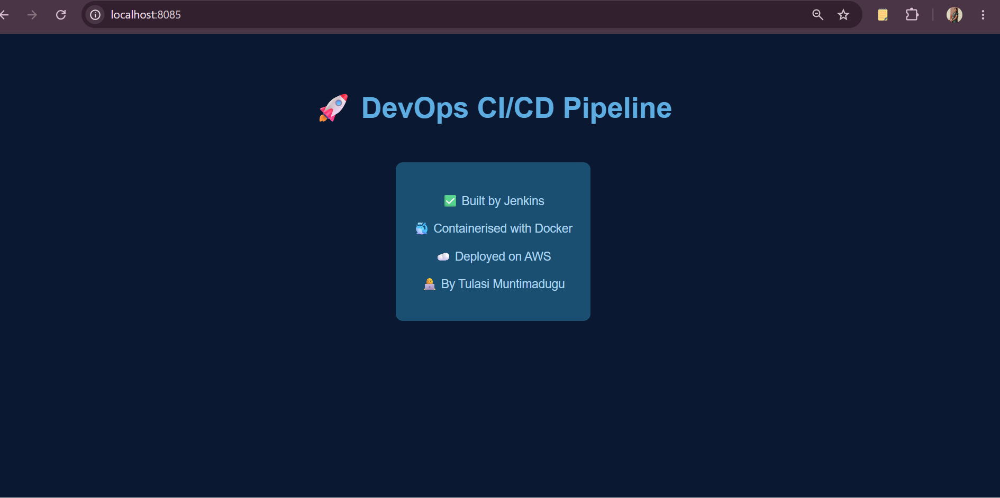
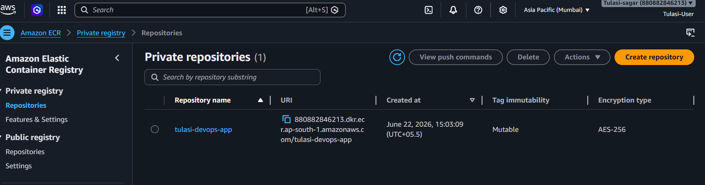
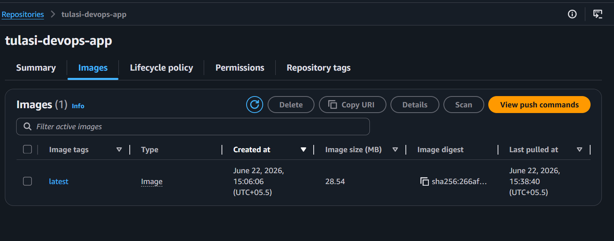
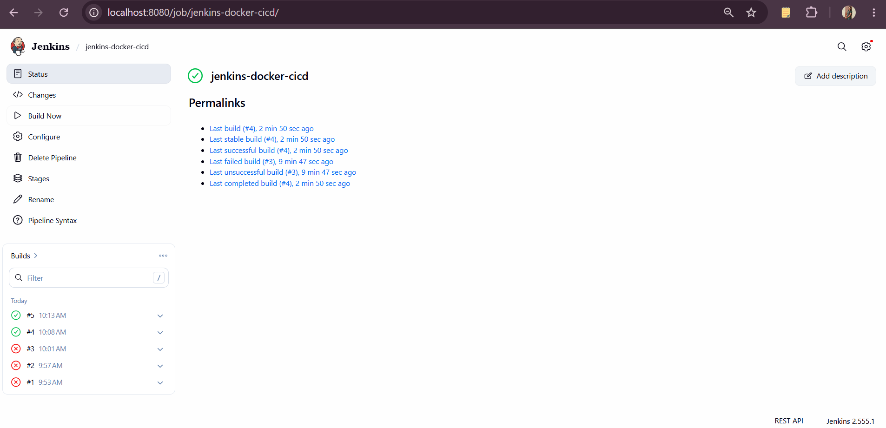
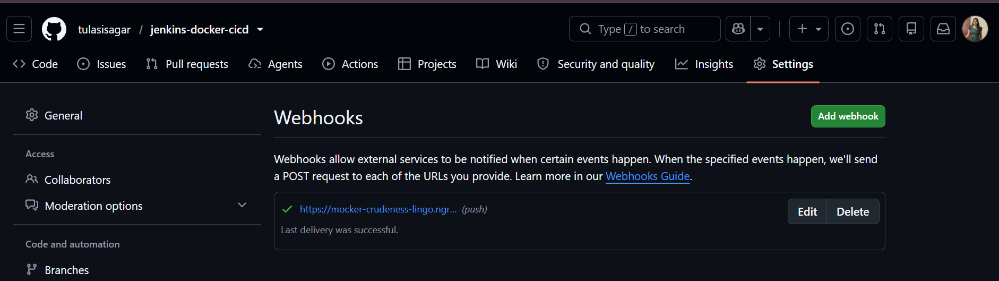
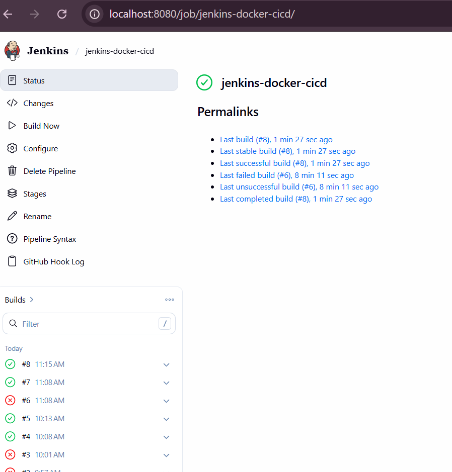

# 🚀 CI/CD Pipeline using Jenkins, Docker, GitHub Webhooks & AWS ECR

## 📌 Project Overview

This project demonstrates an end-to-end CI/CD pipeline that automatically builds, tests, containerizes, and deploys an application whenever code is pushed to GitHub.

The pipeline is implemented using Jenkins Pipeline as Code (Jenkinsfile), Docker, GitHub Webhooks, and AWS ECR.

---

## 🏗️ Architecture

```text
Developer
    ↓
Git Commit
    ↓
Git Push
    ↓
GitHub Repository
    ↓
GitHub Webhook
    ↓
Jenkins Pipeline
    ↓
Docker Build
    ↓
Container Test
    ↓
Push Image to AWS ECR
    ↓
Deploy Container
```

---

## 🛠️ Technologies Used

* Linux (Ubuntu WSL)
* Git & GitHub
* GitHub Webhooks
* Jenkins
* Jenkins Pipeline (Pipeline as Code)
* Docker
* AWS CLI
* Amazon ECR
* Nginx
* HTML

---

## 📂 Project Structure

```text
jenkins-docker-cicd/
│
├── app/
│   └── index.html
│
├── Dockerfile
├── Jenkinsfile
├── README.md
└── screenshots/
```

---

## ⚙️ Pipeline Stages

### 1. Clone Code

Jenkins pulls the latest source code from GitHub.

### 2. Build Docker Image

Creates a Docker image using the Dockerfile.

### 3. Test Container

Runs the container and validates that the application is accessible.

### 4. Push to AWS ECR

Authenticates with Amazon ECR and pushes the Docker image.

### 5. Deploy

Stops any existing container and deploys the latest version.

---

## 🐳 Docker Build

Build image:

```bash
docker build -t tulasi-devops-app .
```

Run container:

```bash
docker run -d -p 8085:80 --name test-app tulasi-devops-app
```

---

## ☁️ AWS ECR Integration

Repository Name:

```text
tulasi-devops-app
```

The Jenkins pipeline automatically:

* Authenticates to AWS ECR
* Tags the Docker image
* Pushes the image to ECR
* Maintains the latest deployable image

---

## 🔄 GitHub Webhook Integration

GitHub Webhooks are configured to automatically trigger Jenkins builds whenever code is pushed to the repository.

```text
Git Push
    ↓
GitHub Webhook
    ↓
Jenkins Auto Trigger
    ↓
Pipeline Execution
```

This removes the need for manually clicking **Build Now** in Jenkins.

---

## 🖥️ Sample Application

The deployed application displays:

* ✅ Built by Jenkins
* 🐳 Containerised with Docker
* ☁️ Deployed on AWS
* 👩‍💻 By Tulasi Muntimadugu

---

## 📸 Screenshots

### Application Page



### AWS ECR Repository



### AWS ECR Image



### Jenkins Pipeline Success



### GitHub Webhook Success



### Jenkins Auto Trigger Build



---

## 🔧 Troubleshooting & Issues Resolved

### Issue 1: Git Branch Mismatch

**Error**

```text
fatal: couldn't find remote ref refs/heads/master
```

**Cause**

Repository used `main` branch while Jenkins was configured for `master`.

**Fix**

Updated Jenkins branch configuration from:

```text
*/master
```

to:

```text
*/main
```

---

### Issue 2: Existing Container Conflict

**Error**

```text
The container name "/test-app" is already in use
```

**Cause**

A container with the same name already existed.

**Fix**

Removed the existing container before running the pipeline.

---

### Issue 3: AWS Credentials Not Found

**Error**

```text
NoCredentials: Unable to locate credentials
```

**Cause**

AWS credentials were configured for the local user but not for the Jenkins user.

**Fix**

Configured AWS credentials for the Jenkins user and verified ECR authentication.

---

## 🎯 Key Learning Outcomes

* Jenkins Pipeline as Code
* Docker image creation and container management
* AWS ECR integration
* GitHub Webhooks automation
* CI/CD workflow implementation
* Linux troubleshooting
* Jenkins credential management
* Real-world DevOps debugging

---

## 👩‍💻 Author

**Tulasi Muntimadugu**

Aspiring DevOps Engineer | AWS | Docker | Jenkins | CI/CD
